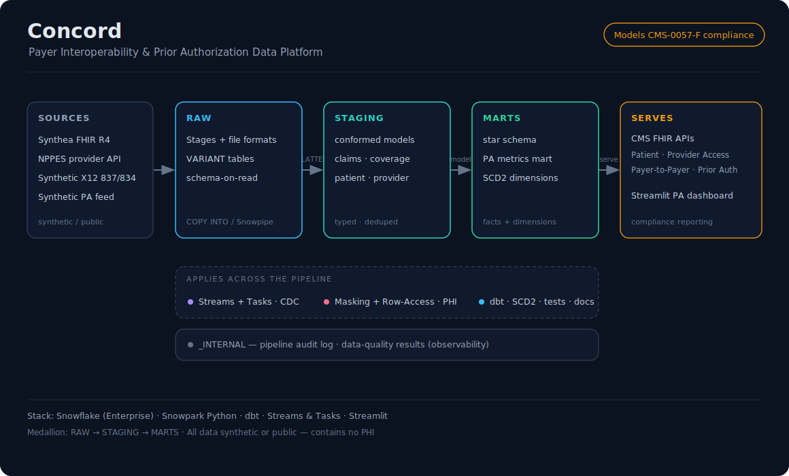

# Concord — Healthcare Payer Data Platform

A production-shaped Snowflake + dbt data platform built on synthetic healthcare
claims, member, and provider data. Designed to demonstrate the full modern data
engineering stack the way a real payer data team would build it — not a tutorial,
not a demo — a platform you can defend end-to-end in an interview.

**Stack:** Snowflake Enterprise · dbt · Snowpark Python · Streams & Tasks · Streamlit · Synthea (FHIR R4) · NPPES API

---

## What this is

Most Snowflake portfolio projects load a CSV into a star schema and call it done.
Concord is different:

- FHIR JSON bundles land as **`VARIANT`** — Snowflake's semi-structured type — and get shredded with `LATERAL FLATTEN`. This is the real ingestion pattern payer data teams use and the feature that actually differentiates Snowflake.
- **dbt** handles all transforms: typed models, `not_null`/`unique` tests as data-quality gates, lineage docs, and SCD Type 2 snapshots for member history.
- **PHI governance** is built in from Day 1 — dynamic data masking on sensitive columns, row-access policies scoping member visibility by role. Not bolted on at the end.
- **CDC** via Snowflake Streams + Tasks: only changed rows propagate downstream, not full reloads.
- **Observability** via a `_INTERNAL.PIPELINE_LOG` audit table every load writes to, and a Streamlit dashboard for ops visibility.

The result: a platform that covers every skill a cloud data engineering interview screens for, grounded in healthcare domain context you can actually talk about.

---

## Architecture



```
SOURCES          RAW                  STAGING               MARTS
─────────        ──────────────       ──────────────────    ──────────────────────
Synthea     ───▶ VARIANT tables  ───▶ conformed models ───▶ star schema
FHIR R4          (landed as-is)       claims, coverage,     fct_claims
                 COPY INTO            patient, provider     dim_member (SCD2)
NPPES API   ───▶ provider JSON        typed + deduped       dim_provider
                                                            dim_date
                                                            pa_metrics_mart
                      │
                      ├── Streams + Tasks → CDC (incremental propagation)
                      ├── Dynamic Masking + Row Access → PHI governance
                      ├── dbt → tests, docs, SCD2 snapshots
                      └── _INTERNAL.PIPELINE_LOG → audit trail (observability)
```

---

## Data sources (synthetic / public — zero real PHI)

| Source | What it provides | How it's used |
|---|---|---|
| **Synthea** | Synthetic FHIR R4 bundles — Patient, Encounter, Claim, ExplanationOfBenefit, Coverage | Primary claims + member feed, lands as `VARIANT` |
| **NPPES API** | Real public provider registry — NPI numbers, taxonomy, address | Provider dimension, real-world data signal |
| **Synthetic PA feed** | Generated prior-auth requests + decisions | Drives the PA metrics mart |

---

## What Concord demonstrates (skill map)

| Skill | Where it shows up |
|---|---|
| Semi-structured ingestion | `VARIANT` tables in `RAW`, `LATERAL FLATTEN` in `STAGING` |
| Cost management | XS warehouses, `AUTO_SUSPEND = 60`, workload isolation |
| RBAC + least privilege | `CONCORD_ENGINEER` / `CONCORD_ANALYST` roles, `FUTURE GRANTS` |
| dbt modeling | Staging models, mart models, sources, refs |
| Data quality | dbt `not_null`, `unique`, `accepted_values` tests |
| SCD Type 2 | dbt snapshot on `dim_member` — member history preserved |
| Snowpark Python | PA metrics model in Python instead of SQL |
| PHI governance | Dynamic masking on DOB/SSN columns, row-access by role |
| CDC | Snowflake Stream on staging table, Task propagates to marts |
| Observability | `PIPELINE_LOG` audit table + Streamlit dashboard |
| Star schema | `fct_claims` + `dim_*` in `MARTS` |

---

## Repository structure

```
concord-payer-interop/
├── README.md
├── docs/
│   ├── architecture.md      # every design decision + prod rationale
│   ├── architecture.svg     # architecture diagram
│   └── build-log.md         # phase-by-phase progress log
├── sql/
│   ├── 00_setup/            # warehouses, DB, schemas, RBAC, audit log
│   ├── 01_raw/              # file formats, stages, VARIANT landing tables
│   ├── 02_staging/          # LATERAL FLATTEN → conformed tables
│   ├── 03_marts/            # star schema + PA metrics
│   └── governance/          # dynamic masking + row-access policies
├── dbt/                     # dbt project: models, snapshots, tests, docs
├── ingestion/
│   ├── synthea/             # Synthea FHIR bundle generation + load scripts
│   └── nppes/               # NPPES provider API pull
├── streamlit/               # ops observability dashboard
└── data/                    # local data files (gitignored)
```

---

## Build phases

| Phase | What's built | Demoable? |
|---|---|---|
| **0 — Setup** | Warehouses, DB, schemas, RBAC, audit log | — |
| **1 — RAW** | Synthea FHIR → stage → `COPY INTO` VARIANT tables | ✅ FHIR + VARIANT |
| **2 — STAGING** | `LATERAL FLATTEN` → conformed claims, member, provider | ✅ core showcase |
| **3 — MARTS** | Star schema + PA metrics mart | ✅ **portfolio-ready** |
| **4 — Governance** | Dynamic masking + row-access policies | ✅ healthcare credibility |
| **5 — dbt** | Staging + mart models, SCD2 snapshot, tests, docs | ✅ auditability |
| **6 — CDC + Streamlit** | Streams + Tasks, observability dashboard | ✅ full platform |

> Phase 3 = demoable and interview-ready. Every phase after is additive.

---

## Running it

```
sql/00_setup/    →  run once on a fresh account
ingestion/       →  generate + land source data
sql/01_raw/      →  create stages + VARIANT tables, COPY INTO
sql/02_staging/  →  LATERAL FLATTEN → conformed
sql/03_marts/    →  star schema + metrics
sql/governance/  →  masking + row-access policies
dbt/             →  dbt run + dbt test + dbt docs generate
streamlit/       →  launch observability dashboard
```

---

## Cost discipline

XS warehouses only · `AUTO_SUSPEND = 60` on every warehouse · `INITIALLY_SUSPENDED = TRUE` at creation · Streams + Tasks demonstrated then suspended · Full build runs well within a Snowflake trial.

---

## PHI note

All data is synthetic or publicly available. Concord contains no real PHI. The governance layer models HIPAA minimum-necessary enforcement patterns on synthetic data.

---

**Status:** 🚧 In progress — see [`docs/build-log.md`](docs/build-log.md)
